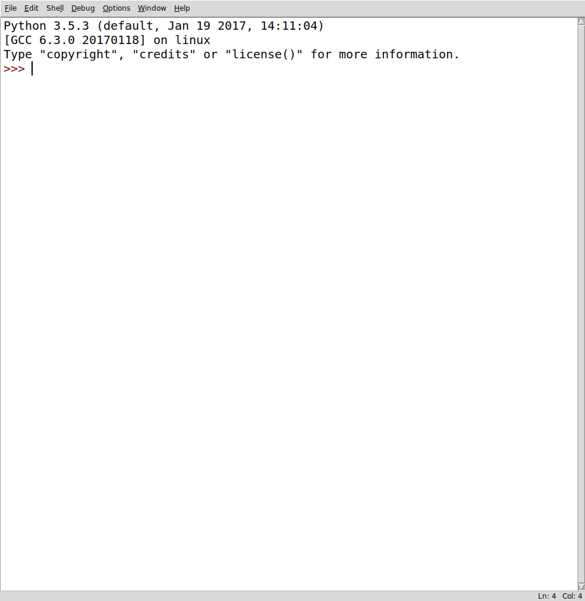

# Python basics


BB2441 

---

layout: false

# Basics of Python


## Running

### Interactively

* `python` without arguments starts up  the interpreter 
* The prompt `>>>` expects Python code lines 

```
    $ python
    >>> print("Hello world")
    Hello world

```

* A read-evaluate-print-loop (REPL)
    - reading a Python expression
    - reducing the expression to a value
    - printing the value to the screen
    - starting over

---

### Executing files

Python scripts or programs are text files with Python statements which are executed
in order

```bash
$ cat file.py
#!/usr/bin/env python
print("Hello world")
```
```
$ python file.py
Hello world
```

#### (Linux)

As for bash, a Python script can be run by typing the name directly on the
command line if the first line is

```
#!/usr/bin/env python
```
(instructs operating system how the script is to be interpreted)
and if it is executable in the Unix sense

```bash
$ chmod +x file.py
$ ./file.py 
Hello world
```


---

### Creating Python scripts

#### Text editors

To enter code into files you need to use a text editor (not a word processor
like Microsoft Word). A text editor if good for programming if it automatically
colors special keywords for the programming language of that file. A simple 
editor that fulfills this is `nano`.

Google search for 
<a href="https://www.google.se/search?q=best%20programming%20editor">
best programming editor
</a>: 
normally lists editors like vim, emacs, atom, sublime.
Spending time to learn one well is worth the investment.


---

### Integrated development environments (IDE)

IDE: Combined editor and execution environment

* idle: a built-in Python IDE

```
$ python -m idlelib.idle
```



---

Other advanced IDEs

* pycharm
* spyder


---

### Notebooks

```
$ jupyter notebook
```

* work/develop in browser
* mix documentation and code


---

### Objects

*Everything is an object* ... almost

Objects have

* value
* type
* identity

```
    >>> 3.14
    3.14
    >>> type(3.14)
    <class 'float'>
    >>> id(3.14)                                                                                 #doctest: +SKIP
    140215166415160

```

in addition

* associated data and/or functions


---

### Some basic Python types

* Logical: `bool`
* Number: `int`, `float`, `complex`
* String: `str`


```python
>>> True
True
>>> type(True)
<class 'bool'>

```
```python
>>> 1
1
>>> type(1)
<class 'int'>

```
```python
>>> 1.0
1.0
>>> type(1.0)
<class 'float'>

```
```python
>>> "one"
'one'
>>> type('one')
<class 'str'>

```


---

### Bool

* True
* False

Comparison operators; `==, !=, >, <, <=, >=`

```python
>>> 1 > 0
True

```
```python
>>> 1 == 0
False

```


Combination operators `and`, `or`

```python
>>> True and False
False

```

```python
>>> True or False
True

```

Others: `in`

```python
>>> 'CAT' in 'CTGATCATCTAC'
True

```

---

### Numbers

* integer - whole numbers: `int`

```python
>>> 8 * 8
64
>>> type(8 * 8)
<class 'int'>

```

* real -  decimal numbers: `float`

```python
>>> type(2), type(3.14)
(<class 'int'>, <class 'float'>)
>>> 2 * 3.14
6.28
>>> type(2 * 3.14)
<class 'float'>
>>> 0.1 + 0.2 # round-off errors
0.30000000000000004

```

* complex (real and imaginary parts) -  `complex`

```python
>>> 1j * 1j
(-1+0j)
>>> type(1j * 1j)
<class 'complex'>

```


---

### Strings

* *str* type
* Single, double or triple quotes

```
>>> 'abc'
'abc'

```
```
>>> "abc"
'abc'

```
```
>>> "abc's"
"abc's"

```
```
>>> """Time to learn
... abc"""
'Time to learn\nabc'

```

* addition operator concatenates strings

```
>>> 'abc' + 'cde'
'abccde'

```

---

* string conversion function

```python
>>> 'Hello'.upper()
'HELLO'
>>> 'Hello'.lower()
'hello'

```

* test only letters

```python
>>> 'Hel-lo'.isalpha()
False

```

---

### Variables

* To save the value of an object it is assigned to a *variable*
* The assignment operator is `=` (not to be confused with the equality
operator `==`)

* Assignment is to bind a name to an object

* Python has so called free typing - one name can have different types

* one object can have many names

```python
>>> pi = 3.14
>>> print(pi)
3.14
>>> π = pi
>>> print(π)
3.14
>>> π is pi
True

```


---

## Container objects

* Lists
* Sets
* Dictionaries

---

### Lists

* A list is a ordered sequence of objects 
* Notation: square brackets `[]` (empty), `[1, 2, 3]`

```python
>>> []
[]
>>> type([])
<class 'list'>

```
* List can have objects of different types
* List members are referenced with `[n]` where `n=0, 1, 2...`

```python
>>> stuff = [1, True, 'you']
>>> stuff[1]
True

```

* Functions on lists:

```python
>>> len(stuff)
3

```

---

* Functions can be attached with the list object (so-called class methods)

```python
>>> stuff.index(True) #surprise
0

```

```python
>>> stuff.append([])
>>> stuff
[1, True, 'you', []]

```


* The `range` function returns a sequence of numbers starting with zero

```python
>>> list(range(3))
[0, 1, 2]

```

* The `join` function creates a single string from a list of strings

```python
>>> 'a' + '|' + 'b' + '|' + 'c'
'a|b|c'
>>> '|'.join(['a', 'b', 'c'])
'a|b|c'

```

* The `split` function splits a string to a list of substrings

```python
>>> 'Hello world'.split()
['Hello', 'world']

```


---

* There is a `list` function that converts another sequence to a `list` object

```python
>>> list()
[]
>>> list('abc')
['a', 'b', 'c']

```

* The `reverse` list function does not return any value, changes in place 

```python
>>> l = [1, 2, 3]
>>> l.reverse()
>>> l
[3, 2, 1]

```
* The general reversed function keeps original and returns opposite order

```python
>>> list(reversed(l))
[1, 2, 3]
>>> l
[3, 2, 1]

```

* The `in` operator tests lists membership

```python
>>> 2 in l
True

```

---

### Tuples

* An immutable (unchangeable) sequence of objects
* Similar to lists
* () is the empty tuple
* (1,)  contains 1 element -note the comma

Handy packing and unpacking

```python
>>> t = 1, 2  #packing
>>> t
(1, 2)
>>> x, y = t  #unpacking
>>> x
1
>>> y
2
>>> x, y = y, x  #swapping
>>> x
2
>>> y
1

```
---

### Dictionaries

* Sets of key-value pairs
* The key can be any immutable object
* Very useful for complex structures
* Efficient and highly optimized

```
empty =  {} # empty dict
newdict = {'a':1, 'b':2}
```

---

### Sets

* Unordered collecetion of objects
* Supports set operations

```
    a = set([1,2]); b = set([2,3])
    a|b #union
    a&b #intersection
```

---

### Repetition (iteration, looping)

* The `for ... in` statement is used repeat the same operation for all elements of a
sequence

* A loop variable will reference the elements of the sequence, one at a time


```python
>>> for e in [1, 2, 3]: 
...    print(e)
1
2
3

```

```python
>>> for c in 'hello':
...     print(c)
h
e
l
l
o

```


```python
>>> for k, v in {'a': 1, 'b': 2}.items():                                       #doctest: +SKIP
...    print(k, v)
a 1
b 2

```


---

### Branching (if statements)

Conditional execution of code blocks depending on whether an expression
evaluates to True or not:

```
>>> if True:
...     print("Yes")
... else:
...     print("No")
Yes

```

```
>>> i = j = 0
>>> if i > j:
...     print(i, " is larger than ", j)
... else:
...     print(i, "is smaller than or equal to", j)
0 is smaller than or equal to 0

```

Most object types have some truthiness. Empty lists in a logical context
evaluate to False, non-empty to True

```
>>> if []:
...     print("Non-empty list")
... else:
...     print("Empty list")
Empty list

```

---

as for dictionaries
```
>>> if {'count': 1}:
...     print("Non-empty dict")
... else:
...     print("Empty dict")
Non-empty dict

```
---

### Functions

* Functions are objects that can take some input and return some output.
Functions are the primary way of grouping code into independent units, that can be tested and reused

* Function definitions start `def`, a name,  parentheses with or without
arguments (comma-separated) and a colon.
The body of the function is indented with respect to the `def` keyword.
The last line of a function definition is normally a `return` statement and determines the value of a function call

```
>>> def square(x):
...    x2 = x * x
...    return x2

```

* Functions are called with function name and an actual parameter. 

```
>>> square(2)
4

```

* Inside the function the formal parameter `x` becomes a reference to the actual
parameter `2`.


---

### Modules


* a file with python source 
   - name is the filename without the ``.py`` extension
* `import` modules to reuse code
* members of module referenced with dot notatoin `module.member`

Commonly used Python modules

* ``sys``
* ``os``
* ``math``

---

#### `sys`

* system modules
* needed e.g. for arguments to a script
* `sys.argv` is a list of string arguments
* `sys.argv\[0\]` is the file name

```
    import sys
    infile = sys.argv[1]
```

#### `os`

* Interaction with operating system
* Example: execute a unix command 

```
    import os
    os.system('/bin/date')
```


#### `math`

* all basic elementry functions
* fundamental constants

```
    import math
    print(math.sin(math.pi/2))
```

#### Tip

Many use the math modules as a desktop calculator

    $ python
    >>> from math import *
    >>> print(pi/2)
    1.5707963267948966
    >>>

---

#### Writing/using your own modules

* Suppose you have written file ``a.py`` with function ``b``
```
    #a.py
    def fun():
        ...
        return some_value
```

* To access the same function in other code, import module
```
    import a
    val = a.fun()
```

* or to import an individual function of a module
```
    from a import fun
    c = fun()
```


---

### Files

```
    >>> fo = open('foo', 'r')

```

* opens the file name for reading
* if is does not exist - Error
* returns a file object assigned to variable fo

```
    >>> file_str = fo.read()

```
* loads the contensts of the file to a string *file_str*

```
    >>> fo.close()

```
* close the file when done

---

### Reading text

Other ways to read a file into memory

* As a list of strings
```
    fo.readlines()
```
* One line at a time
```
    fo.readline() 
```
* In a for loop
```
    fo = open('file.txt') 
    for line in fo:
        *work on line*
```

The for statement is very powerful!
First example of iterator

---

### Summary


* Basic syntax - indentation
* Basic built in variable types
* Scalar and container types
* Modules
* Files


### On-line references

Jake van der Plas: 
<a href="http://nbviewer.jupyter.org/github/jakevdp/WhirlwindTourOfPython/blob/master/Index.ipynb"> A Worldwind Tour of Python</a>

Al Sweigart:
<a href="https://automatetheboringstuff.com">Automate the Boring Stuff with Python</a>
